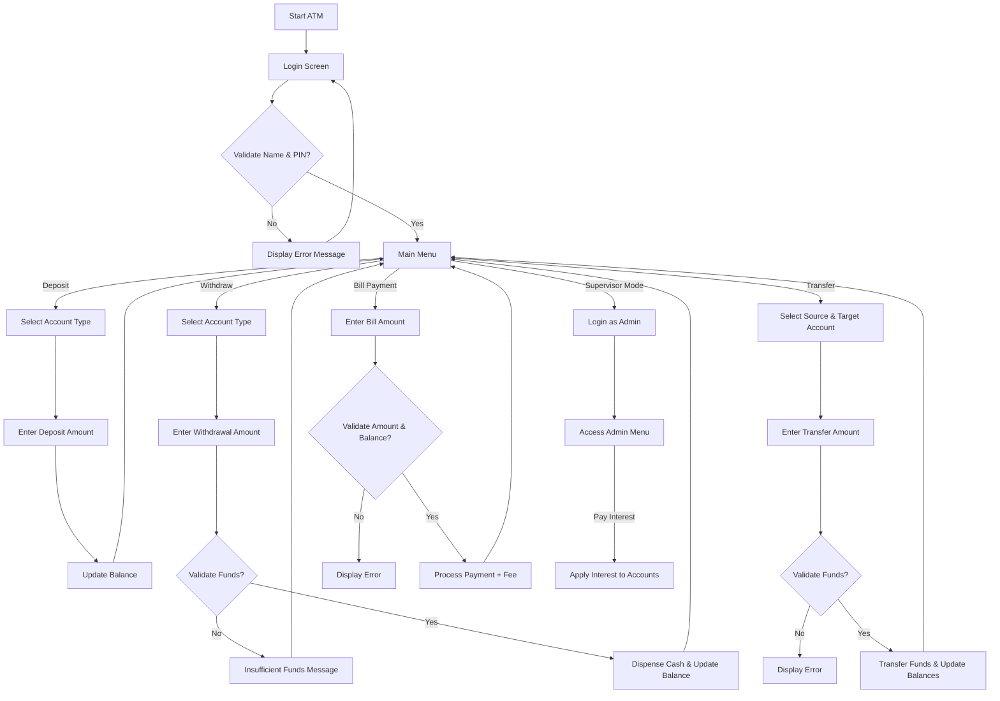
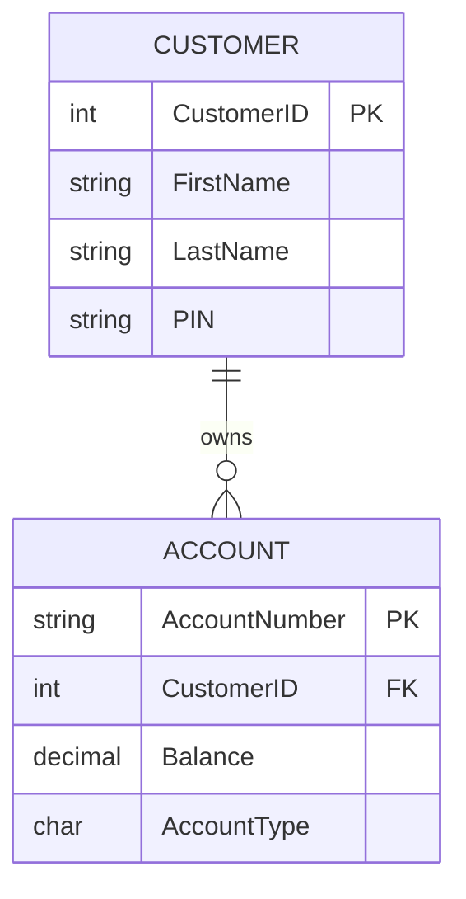
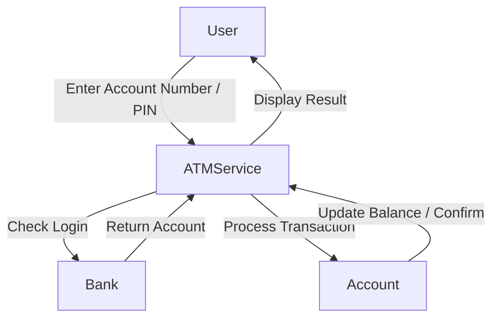
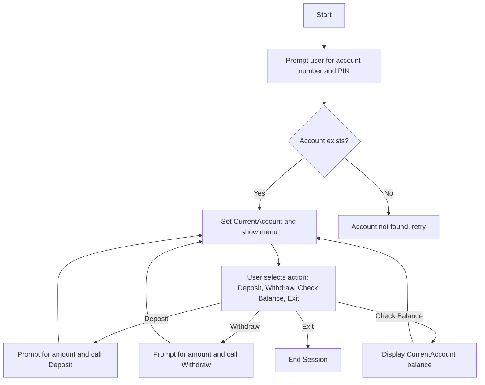
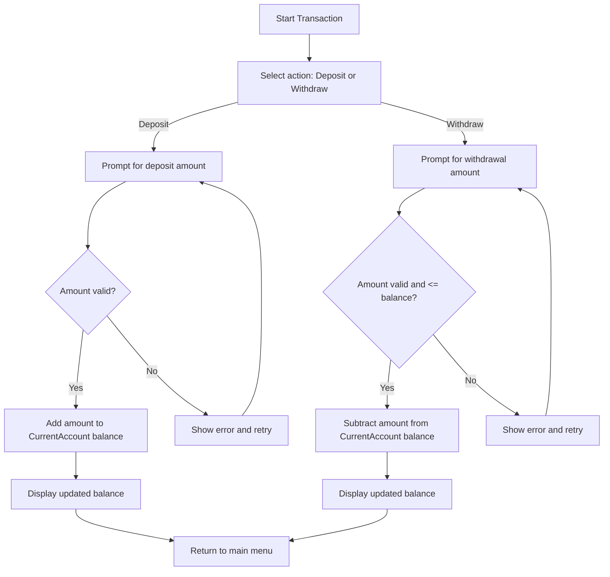

# FINAL PROJECT PART 3

⸻
by: "Marc Cavada"

- **Project 1: Inventory Management System**
- **Project 2/3: ATM Teller**
  
developed in **C# using .NET 9 and Visual Studio Code**. It captures and manages inventory items using **EF Core and SQLite**, exposing a **RESTful API** with Swagger/OpenAPI support.

---
---

## 🔗 Project Repository

The source code and full project files for:

- **Project 1 – Inventory Management System**
- **Project 2 – ATM Teller Simulator**

are available on GitHub:  
[https://github.com/mocavada/CAVADA-MARC-PROJECT-CA_PR](https://github.com/mocavada/CAVADA-MARC-PROJECT-CA_PR)

---

## Project 2 – ATM Teller Simulation

Programming Techniques (CA-PRTQS)

---

## 📂 TellerAPI – Code Files

### Program.cs

```csharp

using System;
using TellerAPI.Models;
using TellerAPI.Services;

namespace TellerAPI
{
    public class Program
    {
        public static void Main()
        {
            Bank bank = new Bank();
            var atm = new ATMService(bank);
            atm.Start();
        }
    }
}


⸻

Models/Account.cs

using System;

namespace TellerAPI.Models
{
    public abstract class Account
    {
        public string AccountNumber { get; set; } = string.Empty;
        public string CustomerID { get; set; } = string.Empty;
        public decimal Balance { get; protected set; }

        public virtual void Deposit(decimal amount)
        {
            if (amount <= 0)
                throw new ArgumentException("Deposit amount must be positive.");
            Balance += amount;
        }

        public virtual bool Withdraw(decimal amount)
        {
            if (amount <= 0)
                throw new ArgumentException("Withdrawal amount must be positive.");
            if (Balance < amount)
                return false;

            Balance -= amount;
            return true;
        }

        public override string ToString() =>
            $"{AccountNumber} | Customer: {CustomerID} | Balance: {Balance:C}";
    }
}


⸻

Models/CheckingAccount.cs & Models/SavingAccount.cs

namespace TellerAPI.Models
{
    public class CheckingAccount : Account { }
    public class SavingAccount : Account { }
}


⸻

Models/Bank.cs

using System;
using System.Collections.Generic;
using TellerAPI.Services;

namespace TellerAPI.Models
{
    public class Bank
    {
        private readonly FileService _fileService;
        public List<Account> Accounts { get; private set; } = new();

        public Bank()
        {
            _fileService = new FileService();
            LoadAccounts();
        }

        private void LoadAccounts()
        {
            var lines = _fileService.ReadFile("Accounts.txt");

            foreach (var line in lines)
            {
                var parts = line.Split(',');
                if (parts.Length < 4) continue;

                string type = parts[0].Trim();           
                string accountNumber = parts[1].Trim();  
                string customerId = parts[2].Trim();     
                if (!decimal.TryParse(parts[3], out decimal balance))
                    balance = 0;

                Account? account = type switch
                {
                    "Checking" => new CheckingAccount { CustomerID = customerId, AccountNumber = accountNumber },
                    "Saving" => new SavingAccount { CustomerID = customerId, AccountNumber = accountNumber },
                    _ => null
                };

                if (account != null && balance > 0)
                    account.Deposit(balance);

                if (account != null)
                    Accounts.Add(account);
            }
        }

        public Account? GetAccount(string accountNumber) =>
            Accounts.Find(a => a.AccountNumber == accountNumber);

        public List<Account> GetAccountsByCustomer(string customerId) =>
            Accounts.FindAll(a => a.CustomerID == customerId);
    }
}


⸻

Services/FileService.cs

using System;
using System.Collections.Generic;
using System.IO;

namespace TellerAPI.Services
{
    public class FileService
    {
        private readonly string _dataPath;

        public FileService()
        {
            _dataPath = Path.Combine(AppContext.BaseDirectory, "..", "..", "..", "Data");
        }

        public List<string> ReadFile(string fileName)
        {
            string path = Path.Combine(_dataPath, fileName);
            if (!File.Exists(path))
            {
                Console.WriteLine($"❌ File not found: {path}");
                return new List<string>();
            }
            return new List<string>(File.ReadAllLines(path));
        }

        public void WriteFile(string fileName, List<string> lines)
        {
            string path = Path.Combine(_dataPath, fileName);
            File.WriteAllLines(path, lines);
        }

        public void AppendLine(string fileName, string line)
        {
            string path = Path.Combine(_dataPath, fileName);
            File.AppendAllText(path, line + Environment.NewLine);
        }
    }
}


⸻

Services/ATMService.cs

using System;
using TellerAPI.Models;

namespace TellerAPI.Services
{
    public class ATMService
    {
        private readonly Bank _bank;
        private Account _currentAccount = null!;

        public ATMService(Bank bank) => _bank = bank;

        public void Start()
        {
            Console.WriteLine("🏦 Welcome to the Teller API");

            // Login
            while (true)
            {
                Console.Write("\nEnter your account number: ");
                string? accNumber = Console.ReadLine();
                var account = _bank.GetAccount(accNumber ?? string.Empty);

                if (account != null)
                {
                    _currentAccount = account;
                    break;
                }
                Console.WriteLine("❌ Account not found. Try again.");
            }

            Console.WriteLine($"\n✅ Logged in as {_currentAccount.CustomerID}!");

            // Transaction loop
            while (true)
            {
                Console.WriteLine("\n1. Deposit\n2. Withdraw\n3. Check Balance\n4. Exit");
                Console.Write("\nSelect an option: ");
                string? input = Console.ReadLine();

                switch (input)
                {
                    case "1": HandleDeposit(); break;
                    case "2": HandleWithdrawal(); break;
                    case "3": Console.WriteLine($"💰 Current Balance: {_currentAccount.Balance:C}"); break;
                    case "4": Console.WriteLine("👋 Thank you for using TellerAPI!"); return;
                    default: Console.WriteLine("❌ Invalid option. Try again."); break;
                }
            }
        }

        private void HandleDeposit()
        {
            Console.Write("Enter deposit amount: ");
            if (decimal.TryParse(Console.ReadLine(), out decimal amount))
            {
                try
                {
                    _currentAccount.Deposit(amount);
                    Console.WriteLine($"✅ New Balance: {_currentAccount.Balance:C}");
                }
                catch (ArgumentException ex) { Console.WriteLine($"❌ {ex.Message}"); }
            }
            else Console.WriteLine("❌ Invalid amount entered.");
        }

        private void HandleWithdrawal()
        {
            Console.Write("Enter withdrawal amount: ");
            if (decimal.TryParse(Console.ReadLine(), out decimal amount))
            {
                try
                {
                    if (_currentAccount.Withdraw(amount))
                        Console.WriteLine($"✅ New Balance: {_currentAccount.Balance:C}");
                    else
                        Console.WriteLine("❌ Insufficient funds!");
                }
                catch (ArgumentException ex) { Console.WriteLine($"❌ {ex.Message}"); }
            }
            else Console.WriteLine("❌ Invalid amount entered.");
        }
    }
}

⸻

📂 Data Files

TellerAPI/Data/Accounts.txt – Each line: <AccountType>,<AccountNumber>,<CustomerID>,<Balance>

```

Example: Checking,10001,D001,457.98
 • Customers.txt – Optional customer info
 • DailyBalances.txt – Optional daily transactions

⸻

Usage

dotnet run --project TellerAPI/TellerAPI.csproj

 • Enter account number to login.
 • Follow menu to deposit, withdraw, or check balance.

⸻

Folder Structure

TellerAPI/
├─ Data/
├─ Models/
├─ Services/
├─ Program.cs
└─ TellerAPI.csproj

⸻

✅ Key Features
 • Loads accounts from Accounts.txt
 • Supports deposit, withdrawal, and balance check
 • Protects Balance with protected set
 • File operations via FileService
 • ATMService handles account operations

⸻

### Program Flow (Teller API Diagram)




---


## Data Dictionary

### Accounts Table

| Field          | Type    | Constraint                  | Description                         |
|----------------|---------|----------------------------|-------------------------------------|
| AccountNumber  | string  | Primary Key, 5 chars       | Unique account identifier           |
| CustomerID     | int     | Foreign Key → Customers    | Owner of the account                |
| Balance        | decimal | Not null                   | Current account balance             |
| AccountType    | char    | 'C' = Checking, 'S' = Savings | Type of account                   |

### Customers Table

| Field       | Type    | Constraint       | Description                         |
|-------------|---------|-----------------|-------------------------------------|
| CustomerID  | int     | Primary Key      | Unique customer identifier           |
| FirstName   | string  | Not null         | Customer's first name                |
| LastName    | string  | Not null         | Customer's last name                 |
| PIN         | string  | 4 digits         | Customer login PIN                    |

### 2️⃣ Relationship Diagram



### Data Flow Diagram (Level 0)



⸻

## Logic Folder (_logic) Draft

### 1️⃣ Class-Method Relationships

Class-Method Relationships

| Class           | Properties                               | Methods                          | Inheritance | Notes                                |
|-----------------|-----------------------------------------|----------------------------------|-------------|--------------------------------------|
| Account         | AccountNumber, CustomerID, Balance       | Deposit(), Withdraw(), ToString()| Base        | Abstract base class                  |
| CheckingAccount | —                                       | —                                | Account     | Derived class                        |
| SavingsAccount  | —                                       | —                                | Account     | Derived class                        |
| Customer        | CustomerID, FirstName, LastName, PIN    | —                                | —           | Holds customer info                   |
| Bank            | List<Account>, List<Customer>           | FindAccount(), LoadFromFiles()   | —           | Collection handler & SQL fallback    |
| ATMService      | CurrentAccount                           | ShowMenu(), ProcessTransaction() | —           | Handles input/output and menu logic  |       |

### 2️⃣ Flowcharts



### 2️⃣ Deposit & Withdraw Logic



### 2️⃣ Pseudocode

WHILE CurrentAccount NOT selected
    PROMPT user for AccountNumber and PIN
    IF account exists in Bank
        SET CurrentAccount
    ELSE
        DISPLAY "Account not found"
LOOP

WHILE user has not exited
    DISPLAY menu: Deposit, Withdraw, Check Balance, Exit
    GET user selection
    IF Deposit selected
        PROMPT for amount
        IF amount > 0
            CurrentAccount.Deposit(amount)
        ELSE
            DISPLAY error
    ELSE IF Withdraw selected
        PROMPT for amount
        IF amount > 0 AND amount <= CurrentAccount.Balance
            CurrentAccount.Withdraw(amount)
        ELSE
            DISPLAY error
    ELSE IF Check Balance
        DISPLAY CurrentAccount.Balance
    ELSE IF Exit
        END session

---
---

#### 👨‍💻 Author

Marc Cavada
Web Design & Development – CDI College

✅ This version is **GitHub-ready**:  