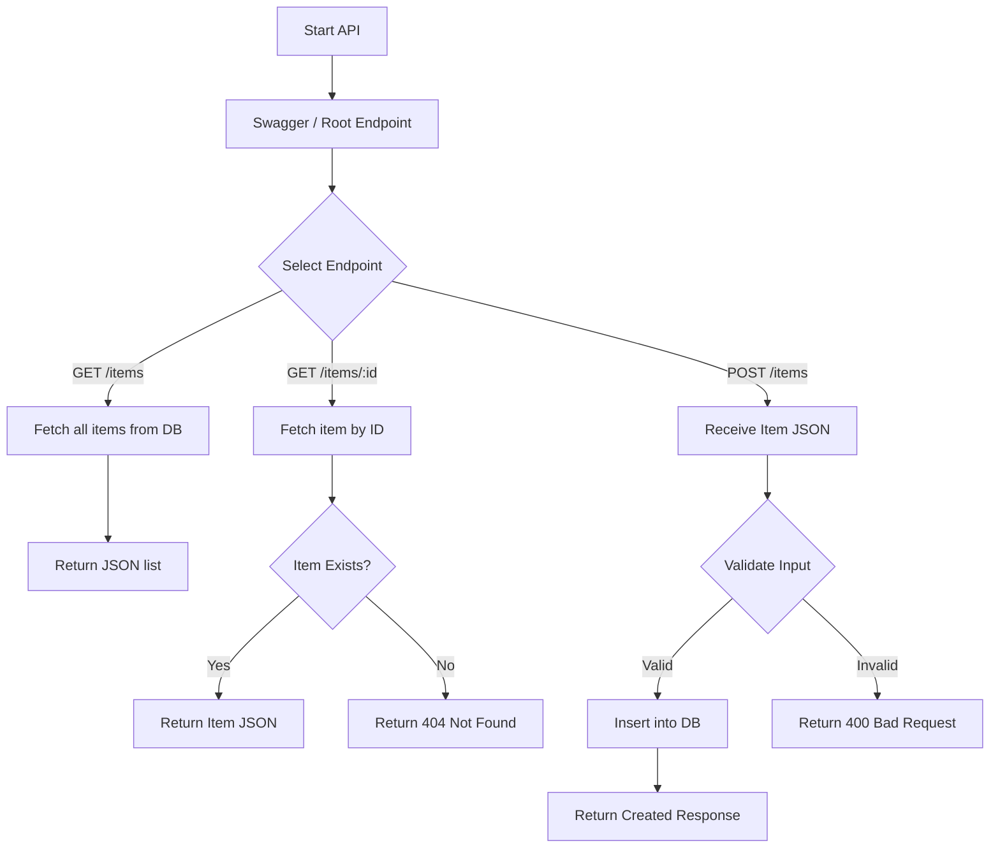
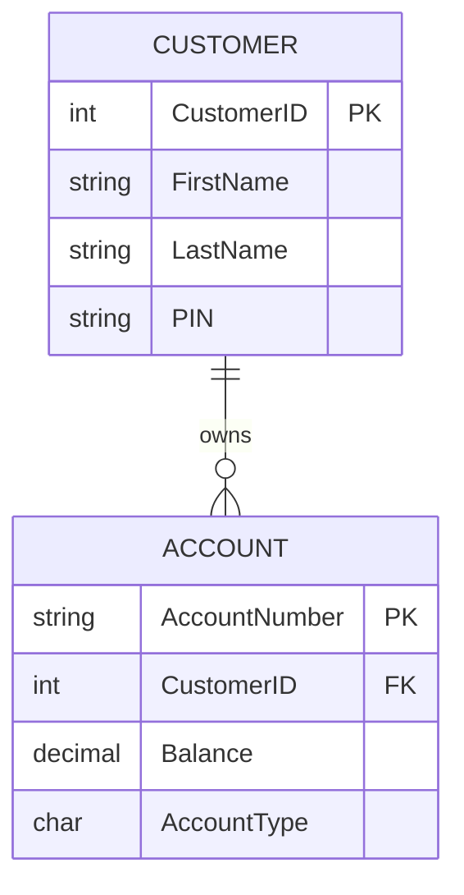
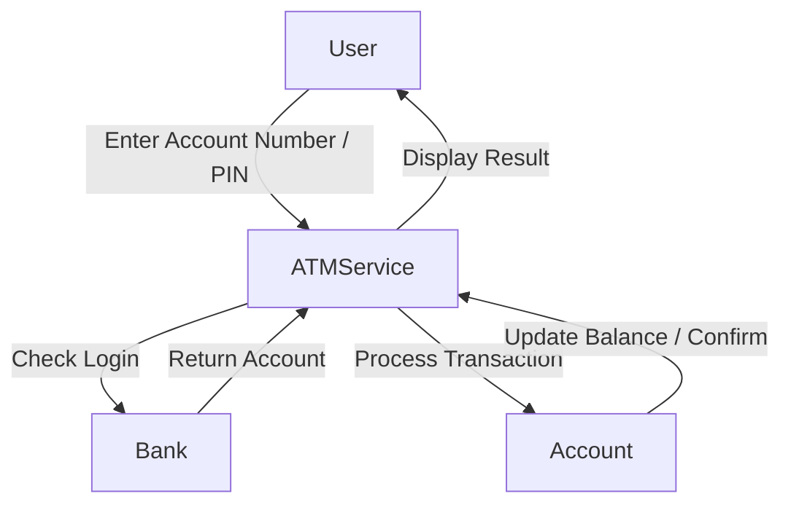
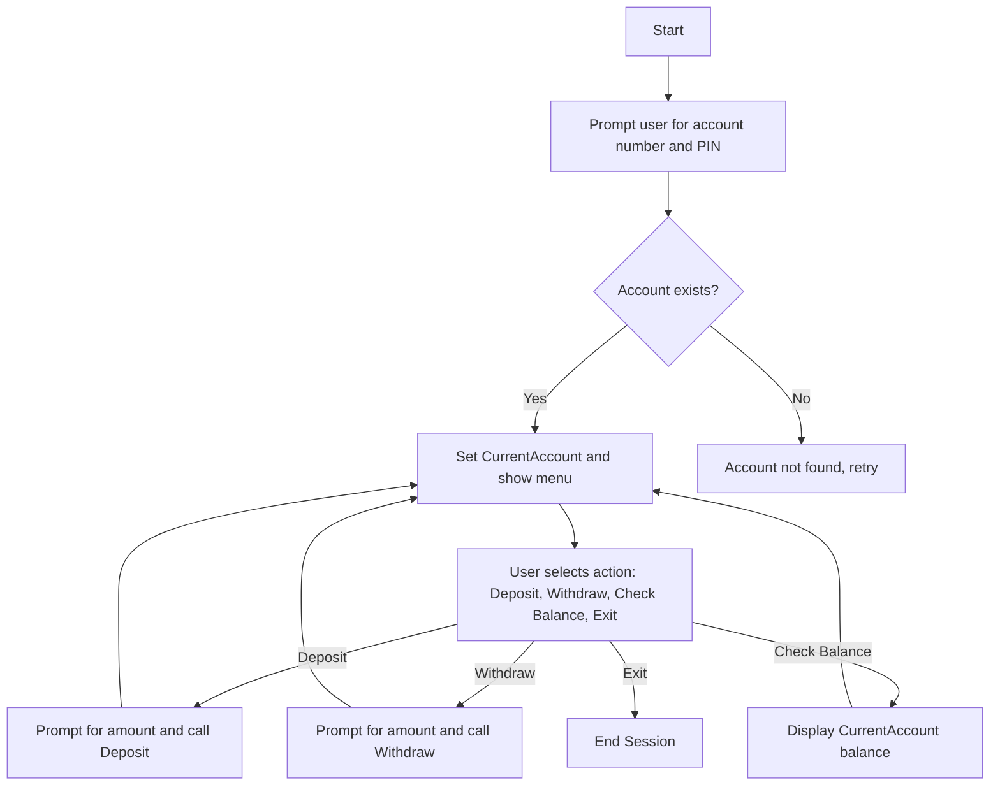
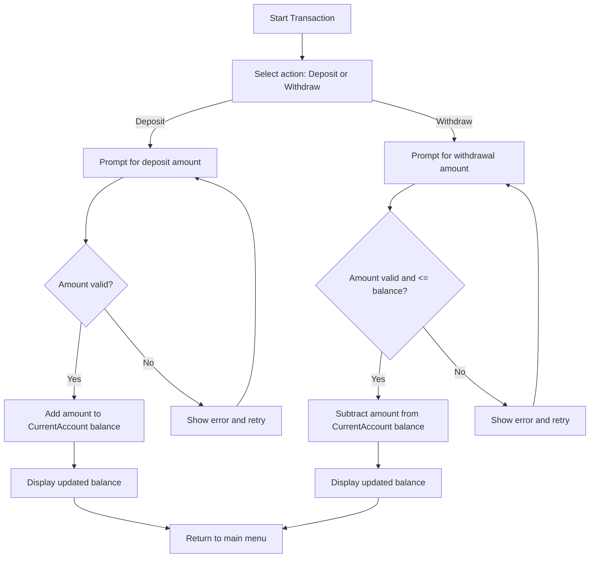

# COOP App Prototype

author: "Marc Cavada"

This project is part of the coop prototype app features:

- **Project 1: Inventory Management System**
- **Project 2: ATM Teller**
  
developed in **C# using .NET 9 and Visual Studio Code**. It captures and manages inventory items using **EF Core and SQLite**, exposing a **RESTful API** with Swagger/OpenAPI support.

---
---

## 🔗 Project Repository

The source code and full project files for:

- **Project 1 – Inventory Management System**
- **Project 2 – ATM Teller Simulator**

are available on GitHub:  
[https://github.com/mocavada/CAVADA-MARC-PROJECT-CA_PR](https://github.com/mocavada/CAVADA-MARC-PROJECT-CA_PR)

---

## Project 2 – ATM Teller Simulation

Programming Techniques (CA-PRTQS)

---

## 📂 InventoryAPI – Code Files

### 1. Program.cs

```csharp
using Microsoft.EntityFrameworkCore;
using InventoryAPI;

var builder = WebApplication.CreateBuilder(args);

builder.Services.AddDbContext<InventoryDbContext>(options =>
    options.UseSqlite("Data Source=inventory.db"));

builder.Services.AddEndpointsApiExplorer();
builder.Services.AddSwaggerGen();

var app = builder.Build();

if (app.Environment.IsDevelopment())
{
    app.UseSwagger();
    app.UseSwaggerUI();
}

app.UseHttpsRedirection();

app.MapGet("/", () => "Inventory API is running.");
app.MapGet("/items", async (InventoryDbContext db) => await db.Items.ToListAsync());
app.MapGet("/items/{id}", async (int id, InventoryDbContext db) =>
{
    var item = await db.Items.FindAsync(id);
    return item != null ? Results.Ok(item) : Results.NotFound();
});
app.MapPost("/items", async (Item newItem, InventoryDbContext db) =>
{
    db.Items.Add(newItem);
    await db.SaveChangesAsync();
    return Results.Created($"/items/{newItem.Id}", newItem);
});

app.Run();
```

### 2. InventoryDbContext.cs

```csharp
using Microsoft.EntityFrameworkCore;

namespace InventoryAPI
{
    public class InventoryDbContext: DbContext
    {
        public InventoryDbContext(DbContextOptions<InventoryDbContext> options) : base(options) { }
        public DbSet<Item> Items { get; set; }
    }
}
```

### 3. Item.cs

```csharp
namespace InventoryAPI
{
    public record Item(int Id, string FirstName, string LastName, double Price);
}
```

### 4. InventoryAPI.csproj

```csharp
<Project Sdk="Microsoft.NET.Sdk.Web">
  <PropertyGroup>
    <TargetFramework>net9.0</TargetFramework>
    <Nullable>enable</Nullable>
    <ImplicitUsings>enable</ImplicitUsings>
  </PropertyGroup>
  <ItemGroup>
    <PackageReference Include="Microsoft.EntityFrameworkCore.Sqlite" Version="8.0.7" />
    <PackageReference Include="Microsoft.EntityFrameworkCore.Tools" Version="8.0.7">
      <PrivateAssets>all</PrivateAssets>
      <IncludeAssets>runtime; build; native; contentfiles; analyzers; buildtransitive</IncludeAssets>
    </PackageReference>
    <PackageReference Include="Swashbuckle.AspNetCore" Version="6.7.0" />
  </ItemGroup>
</Project>
```

### 5. InventoryAPI.http

```csharp
GET https://localhost:7255/items
GET https://localhost:7255/items/1
POST https://localhost:7255/items
Content-Type: application/json

{
  "id": 101,
  "firstName": "Apple",
  "lastName": "Box",
  "price": 499.99
}
```

🧰 Setup Instructions

Prerequisites
 • .NET 9 SDK
 • Visual Studio Code or Visual Studio
 • SQLite CLI (optional)

Build & Run

cd InventoryAPI
dotnet restore
dotnet build
dotnet run

API will run on:
 • HTTPS: <https://localhost:7255>
 • HTTP: <http://localhost:5091>

Database Migrations

dotnet ef migrations add InitialCreate --project InventoryAPI
dotnet ef database update --project InventoryAPI

⸻

💾 Database Model

Item.cs

```csharp
public class Item
{
    public int Id { get; set; }
    public string FirstName { get; set; }
    public string LastName { get; set; }
    public double Price { get; set; }
}
```

InventoryDbContext.cs

```csharp
using Microsoft.EntityFrameworkCore;

public class InventoryDbContext: DbContext
{
    public InventoryDbContext(DbContextOptions<InventoryDbContext> options) : base(options) { }
    public DbSet<Item> Items { get; set; }
}
```

⚙️ API Endpoints

Endpoint Method Description
/ GET Health check / Root message
/items GET Fetch all items
/items/{id} GET Fetch a single item by ID
/items POST Add a new item

Swagger UI: <https://localhost:7255/swagger>

📊 Program Flow (Diagram)

---

### Inventory API




⸻

🔧 Development Highlights
 • Minimal API with ASP.NET Core
 • EF Core SQLite integration
 • Input validation for IDs and prices
 • Async/await for database operations
 • Swagger/OpenAPI for endpoint testing

⸻

🧩 Folder Structure

InventoryAPI/
├── Program.cs
├── Item.cs
├── InventoryDbContext.cs
├── appsettings.json
├── appsettings.Development.json
├── Properties/
├── bin/
├── obj/
└── InventoryAPI.csproj

⸻
FINAL PROJECT
⸻

## Data Dictionary

### Accounts Table

| Field          | Type    | Constraint                  | Description                         |
|----------------|---------|----------------------------|-------------------------------------|
| AccountNumber  | string  | Primary Key, 5 chars       | Unique account identifier           |
| CustomerID     | int     | Foreign Key → Customers    | Owner of the account                |
| Balance        | decimal | Not null                   | Current account balance             |
| AccountType    | char    | 'C' = Checking, 'S' = Savings | Type of account                   |

### Customers Table

| Field       | Type    | Constraint       | Description                         |
|-------------|---------|-----------------|-------------------------------------|
| CustomerID  | int     | Primary Key      | Unique customer identifier           |
| FirstName   | string  | Not null         | Customer's first name                |
| LastName    | string  | Not null         | Customer's last name                 |
| PIN         | string  | 4 digits         | Customer login PIN                    |

### 2️⃣ Relationship Diagram



### Data Flow Diagram (Level 0)



⸻

## Logic Folder (_logic) Draft

### 1️⃣ Class-Method Relationships

Class-Method Relationships

| Class           | Properties                               | Methods                          | Inheritance | Notes                                |
|-----------------|-----------------------------------------|----------------------------------|-------------|--------------------------------------|
| Account         | AccountNumber, CustomerID, Balance       | Deposit(), Withdraw(), ToString()| Base        | Abstract base class                  |
| CheckingAccount | —                                       | —                                | Account     | Derived class                        |
| SavingsAccount  | —                                       | —                                | Account     | Derived class                        |
| Customer        | CustomerID, FirstName, LastName, PIN    | —                                | —           | Holds customer info                   |
| Bank            | List<Account>, List<Customer>           | FindAccount(), LoadFromFiles()   | —           | Collection handler & SQL fallback    |
| ATMService      | CurrentAccount                           | ShowMenu(), ProcessTransaction() | —           | Handles input/output and menu logic  |       |

### 2️⃣ Flowcharts



### 2️⃣ Deposit & Withdraw Logic



### 2️⃣ Pseudocode

WHILE CurrentAccount NOT selected
    PROMPT user for AccountNumber and PIN
    IF account exists in Bank
        SET CurrentAccount
    ELSE
        DISPLAY "Account not found"
LOOP

WHILE user has not exited
    DISPLAY menu: Deposit, Withdraw, Check Balance, Exit
    GET user selection
    IF Deposit selected
        PROMPT for amount
        IF amount > 0
            CurrentAccount.Deposit(amount)
        ELSE
            DISPLAY error
    ELSE IF Withdraw selected
        PROMPT for amount
        IF amount > 0 AND amount <= CurrentAccount.Balance
            CurrentAccount.Withdraw(amount)
        ELSE
            DISPLAY error
    ELSE IF Check Balance
        DISPLAY CurrentAccount.Balance
    ELSE IF Exit
        END session

---
---

#### 👨‍💻 Author

Marc Cavada
Web Design & Development – CDI College

✅ This version is **GitHub-ready**:  
